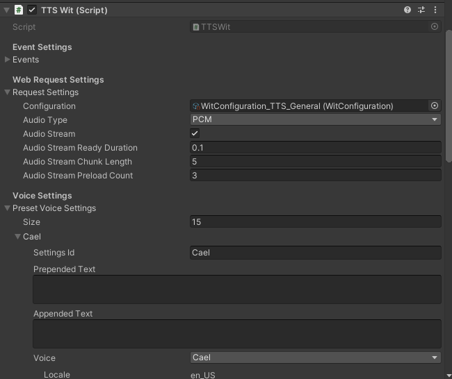
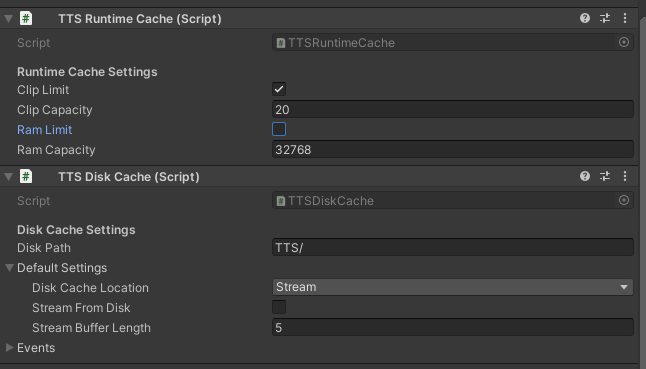

# Text-to-Speech Overview

## Overview

Voice SDK’s Text-to-Speech (TTS) feature uses a Wit.ai based service to provide audio files for text strings. It’s handled by a single TTSService prefab for all TTS settings and you can use a simple TTSSpeaker script for each scene location in which a TTS clip can be played.

To keep TTS working smoothly, Voice SDK handles the caching of TTS files during runtime (or when otherwise needed). If streaming TTS audio files is not an option for your application, however, you can set it to use preloaded static TTS files prior to building your app.

<b>Note:</b> With this initial release of TTS, only a few Wit.ai TTS voice settings are adjustable, but the package will be updated as more voices become available.

## Setup

Use the following steps to set up TTS for your app once the plugin has been imported:
1. Open the scene you want to use TTS within.
2. Generate a new Wit Configuration using the Wit Configurations menu within the Oculus > Voice SDK > Voice HUB.  Ensure it refreshes successfully and displays all voices available for your configuration.
2. Navigate to Assets > Create > Voice SDK > TTS > Add Default TTS Setup
3. In your scene heirarchy navigate inside the newly generated TTS GameObject to select the TTSWitService gameobject and adjust the inspector to fit your needs:
    3a. Use TTSWit > Request Settings > Configuration to select the Wit Configuration asset generated in step 2.
    3b. Once your configuration is setup, go to 'Preset Voice Settings' and setup any voices that might be shared by multiple TTSSpeakers.
        For more information, see TTS Voice Customization: https://developer.oculus.com/documentation/unity/voice-sdk-tts-voice-customization
    
    3c. Under TTS Runtime Cache (Script), adjust the settings to indicate how often clips will be automatically uploaded from memory.
        For more information, see TTS Cache Options: https://developer.oculus.com/documentation/unity/voice-sdk-tts-cache-options
    3d. If needed, adjust your disk cache directory location and name in the tree under TTS Disk Cache (Script).
        For more information, see TTS Cache Options: https://developer.oculus.com/documentation/unity/voice-sdk-tts-cache-options/
    
4. Move & duplicate the TTSSpeaker to all the locations in your app where you would like TTS to be played.
5. Modify each TTSSpeaker via the Inspector to fit your needs:
    5a. Under Voice Settings, select the Voice Preset for the specific speaker or select Custom to apply speaker specific settings.
    5b. Adjust the AudioSource in order to add the TTSSpeaker to a custom audio group or set audio from 2D to 3D.
6. Via a script use the following TTSSpeaker methods to load and play text.
    6a. Use the TTSSpeaker script’s Speak(textToSpeak : string) method to request and say specified text on load.
    6b. Use the TTSSpeaker script’s SpeakQueued(textToSpeak : string) method to request and say specified text.
    6c. Send a custom TTSSpeakerClipEvents into any Speak/SpeakQueued method for request specific text load & playback event callbacks.
    6d. Use the TTSSpeaker script’s Stop() method to immediately stop all loading & playing TTS clips.
    6e. Use TTSSpeaker's Stop(textToSpeak : string) to immediately stop loading & playing of a specific text string.

<b>Note:</b> Check out TTS/Samples/Scenes/TTSSample.unity for an example of TTS implementation. Ensure that you set your WitConfiguration to the sample prior to running.
